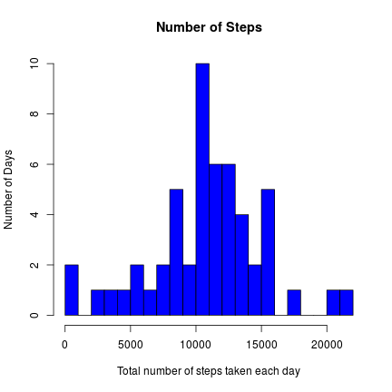
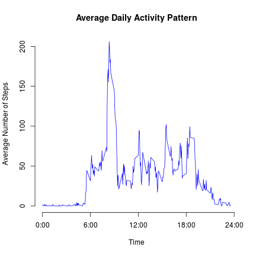
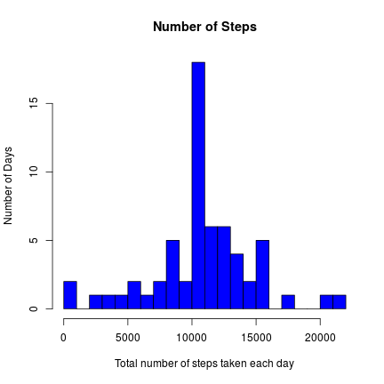
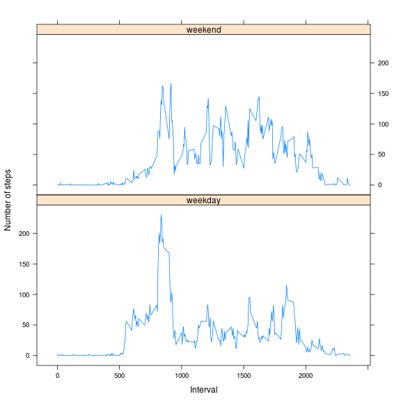

## Loading and preprocessing the data

Download the data and unzip if necessary

```r
if(!file.exists("activity.csv")) {
  if(!file.exists("activity.zip")) download.file(url="https://d396qusza40orc.cloudfront.net/repdata%2Fdata%2Factivity.zip", destfile="activity.zip", method="curl")
  unzip("activity.zip")
}
```
Load the data (i.e. read.csv())

```r
activity.df <- read.csv("activity.csv", header=T)
```

## What is mean total number of steps taken per day?

For this part of the assignment, we ignore the missing values in the dataset.

```r
activity.naomit.df <- na.omit(activity.df)
```
### 1. Make a histogram of the total number of steps taken each day

```r
totalsPerDay <- ddply(activity.naomit.df, .(date), summarise, steps=sum(steps))
```


```r
hist(totalsPerDay$steps, breaks = 20, main="Number of Steps", 
     xlab="Total number of steps taken each day", ylab = "Number of Days", col="blue")
```

 

### 2. Calculate and report the mean and median total number of steps taken per day


```r
mean(totalsPerDay$steps)
```

```
## [1] 10766.19
```

```r
median(totalsPerDay$steps)
```

```
## [1] 10765
```

## What is the average daily activity pattern?

### 1. Make a time series plot (i.e. type = "l") of the 5-minute interval (x-axis) and the average number of steps taken, averaged across all days (y-axis)


```r
averagePerInterval <- ddply(activity.naomit.df, .(interval), summarise, steps=mean(steps))
```


```r
plot(averagePerInterval$interval, averagePerInterval$steps,axes = F, type="l", col="blue", xlab="Time", ylab="Average Number of Steps",
     main="Average Daily Activity Pattern")
axis(1,at=c(0,600,1200,1800,2400), label = c("0:00","6:00","12:00","18:00","24:00"))
axis(2)
```

 

### 2. Which 5-minute interval, on average across all the days in the dataset, contains the maximum number of steps?


```r
averagePerInterval[which.max(averagePerInterval$steps),]
```

```
##     interval    steps
## 104      835 206.1698
```

The interval from 8:35 to 8:40 contains the max number of steps

## Imputing missing values

### 1. Calculate and report the total number of missing values in the dataset (i.e. the total number of rows with NAs)

```r
sum(!complete.cases(activity.df))
```

```
## [1] 2304
```

### 2. Devise a strategy for filling in all of the missing values in the dataset. The strategy does not need to be sophisticated. For example, you could use the mean/median for that day, or the mean for that 5-minute interval, etc.

We will fill the NA with average value for that 5-min interval

### 3. Create a new dataset that is equal to the original dataset but with the missing data filled in.


```r
activity.naavg.df <- activity.df
for (i in 1:nrow(activity.naavg.df)){
    if (is.na(activity.naavg.df$steps[i])){
        activity.naavg.df$steps[i] <- averagePerInterval$steps[which(activity.naavg.df$interval[i] == averagePerInterval$interval)]}
}
activity.naavg.df <- arrange(activity.naavg.df, interval)
```

### 4. Make a histogram of the total number of steps taken each day and Calculate and report the mean and median total number of steps taken per day. Do these values differ from the estimates from the first part of the assignment? What is the impact of imputing missing data on the estimates of the total daily number of steps?


```r
totalsPerDayactivity.naavg.df <- ddply(activity.naavg.df, .(date), summarise, steps=sum(steps))
```


```r
hist(totalsPerDayactivity.naavg.df$steps, breaks = 20, main="Number of Steps", xlab="Total number of steps taken each day", ylab = "Number of Days", col="blue")
```

 


```r
mean(totalsPerDayactivity.naavg.df$steps)
```

```
## [1] 10766.19
```

```r
median(totalsPerDayactivity.naavg.df$steps)
```

```
## [1] 10766.19
```


```r
abs(mean(totalsPerDay$steps)- mean(totalsPerDayactivity.naavg.df$steps))
```

```
## [1] 0
```

```r
abs(median(totalsPerDay$steps)- median(totalsPerDayactivity.naavg.df$steps))/median(totalsPerDay$steps) * 100
```

```
## [1] 0.01104207
```

The mean didn't change after the imputing, the median slightly changed about 0.01% of the original value.


```r
print(totalDifference <- sum(activity.naavg.df$steps) - sum(activity.naomit.df$steps))
```

```
## [1] 86129.51
```

Imputing missing values to the dataset caused the estimation of total steps per day to increase, especially in the `10000-12000` range

## Are there differences in activity patterns between weekdays and weekends?

### 1. Create a new factor variable in the dataset with two levels -- "weekday" and "weekend" indicating whether a given date is a weekday or weekend day.


```r
activity.naavg.df$weekdays <- weekdays(as.Date(activity.naavg.df$date))
activity.naavg.df$weekdays <- ifelse(activity.naavg.df$weekdays %in% c("Saturday", "Sunday"),"weekend", "weekday")
```

### 2. Make a panel plot containing a time series plot (i.e. type = "l") of the 5-minute interval (x-axis) and the average number of steps taken, averaged across all weekday days or weekend days (y-axis). 


```r
average <- ddply(activity.naavg.df, .(interval, weekdays), summarise, steps=mean(steps))
```


```r
xyplot(steps ~ interval | weekdays, data = average, layout = c(1, 2), type="l", xlab = "Interval", ylab = "Number of steps")
```

 
